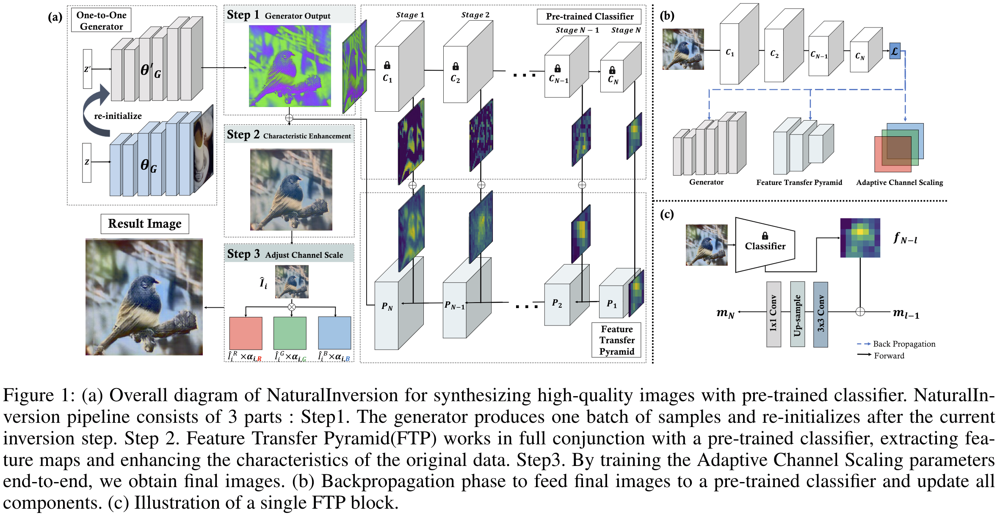
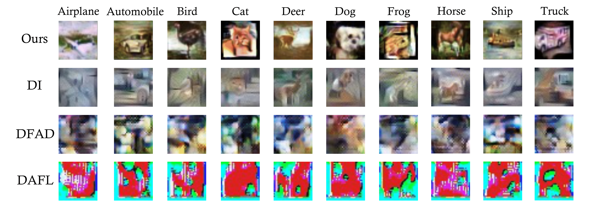
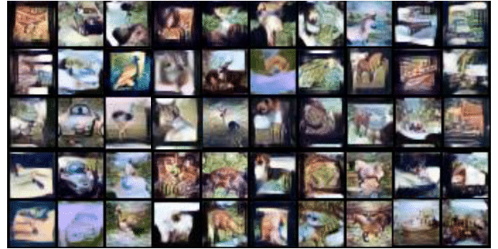

# Natural Inversion: Data-free Image Synthesis Improving Real-World Consistency

This repository is the official PyTorch implementation of Natural Inversion.



## Requirments

Code was tested in anaconda virtual environment with Python 3.8.

```jsx
conda env create -f NI.yaml
```

## Synthesize images

This snippet will generate cifar-10 256 iamges by inverting resnet34 model

```jsx
python NaturalInversion.py \
--dataset $dataset \
--arch $arch \
--bs 256 \
--iters_mi $epoch \
--G_lr 0.001 \
--D_lr 0.0005 \
--A_lr 0.05 \
--var_scale 6.0E-03 \
--l2_scale 1.5E-05 \
--r_feature_weight $bn_scale \
--teacher_weight pretrained/cifar10_resnet34_9557.pt \
--exp_name "$dataset"_"$arch"_paperparameters \
--global_iter 0
```

- dataset - dataset that you want to synthesize. cifar10 and cifar100 are abailable
- arch - pre-trained teacher network architecture. resnet34, vgg11, vgg16 are available
- bs - batchsize. we use 256 as a paper parameter
- G_lr - Generator learning rate. We use 0.001 as a paper parameter
- D_lr - Feature Transfer Pyramid learning rate. We use 0.0005 as a paper parameter
- A_lr - Adaptive Channel Scalining parameters learning rate. We use 0.05 as a paper parameter
- var_scale - synthesized images total variance scaling parameter
- l2_scale -  synthesized images l2 norm scalining parameter
- teacher_weight - teacher weight directory
- exp_name - experiments name. Synthesized images will be sorted in "./{exp_name}"
- global_iter - This is a batch index of whole dataset.

or **just execute the bash file**

```jsx
bash gen_images.sh
```
- Visualization CIFAR-10 samples with previous works


- After 2000 iteration, these images should be generated.
<p align="center"></p>


